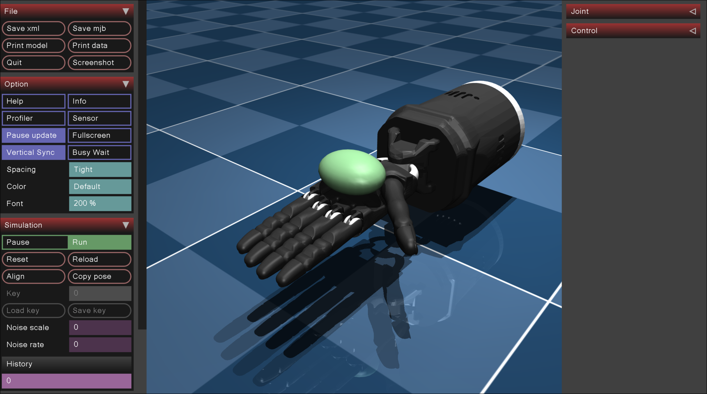

# Hand manipulation
Repository for a hand manipulation project from a course.

# Getting Started

1. Install docker https://docs.docker.com/engine/install/
2. Build the docker file
```bash
docker build <path/to/this/repo> -t hand_manipulation
```
3. Run 
```bash
source start_hand.sh
```
to start the docker container with X11 permissions, same network and privileged setting (a bit hacky but enough)
4. Test that mujoco is working by visualizing the shadow hand on mujoco
```bash
cd ~ && python3 -m mujoco.viewer --mjcf mujoco_menagerie/shadow_hand/scene_left.xml
```
You should be prompted with this screen:

